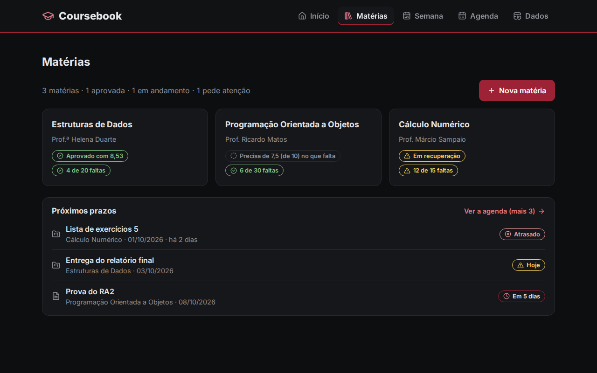
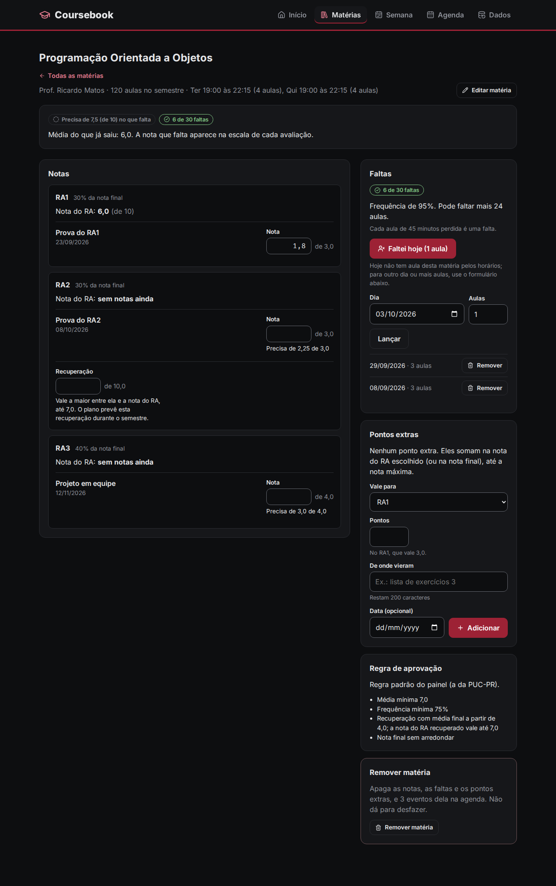
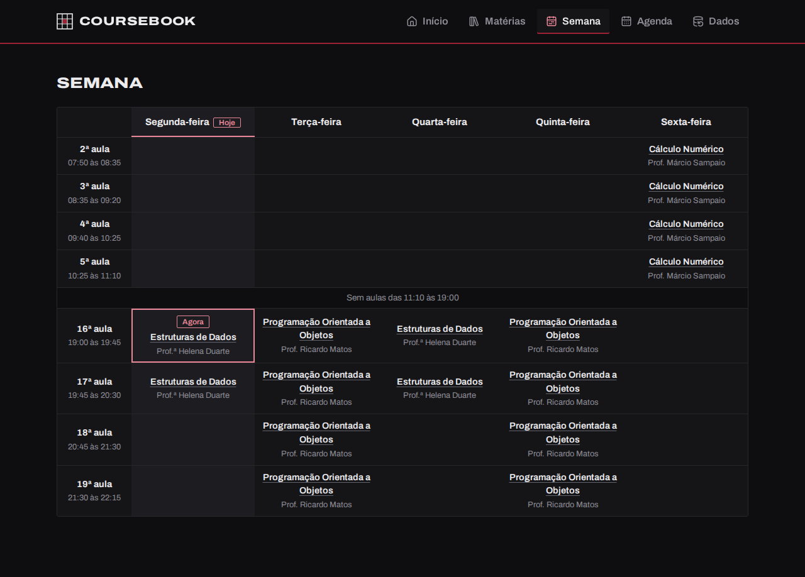
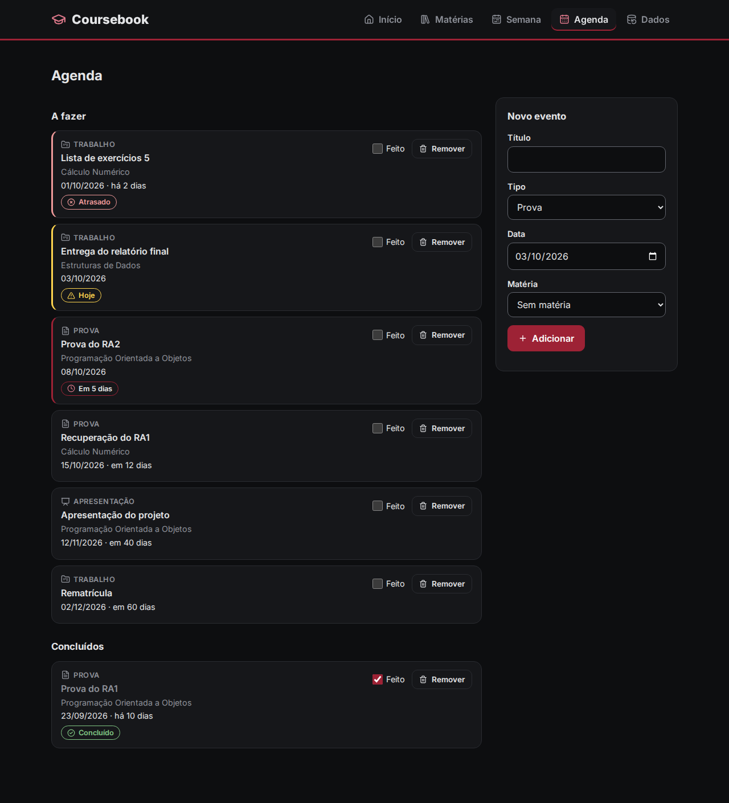
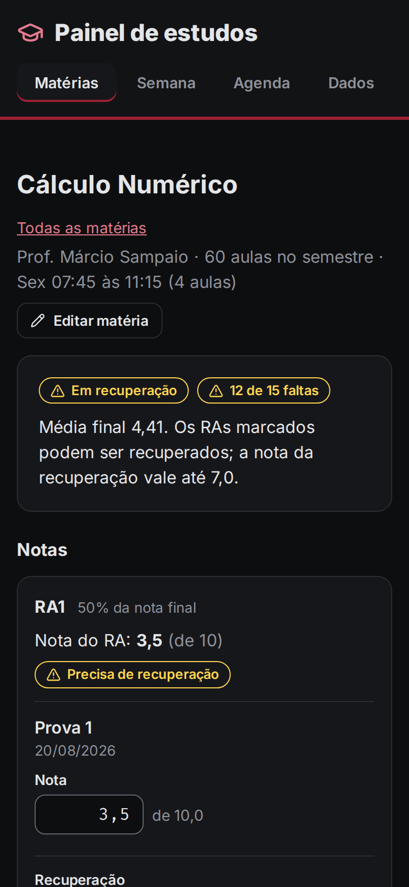

# Painel de estudos

[](https://github.com/Lakes777/painel-estudos/actions/workflows/testes.yml)

Painel para acompanhar o semestre da faculdade: notas por RA, faltas, pontos extras e a agenda
de provas e trabalhos, num lugar só. Ele calcula quanto falta para passar em cada matéria,
seguindo a regra de aprovação da PUC-PR (configurável por matéria).

Os dados ficam só no navegador (localStorage). Não tem servidor, login nem banco de dados.

**No ar:** https://painel-estudos-cyan.vercel.app (o painel abre vazio; "Ver com dados de exemplo"
mostra como ele fica em uso).

## Demonstração







<p>
  
  
</p>

Os prints usam os dados de exemplo (matérias e professores inventados), que qualquer um pode
carregar no painel vazio com "Ver com dados de exemplo".

## Funcionalidades

- **Matérias do jeito do plano de ensino:** cada matéria tem RAs (Resultados de Aprendizagem)
  com peso na nota final, e cada RA tem as avaliações dele, com valor (10, ou 3,0 numa prova
  "que vale 3 pontos") e peso.
- **Quanto falta para passar:** mostra a situação da matéria (aprovado, precisa de nota,
  recuperação, reprovado) e, em cada avaliação pendente, a nota necessária na escala dela
  ("Precisa de 2,1 de 3,0").
- **Recuperação:** vale a maior nota entre o RA e a recuperação, com teto de 7,0, como na
  resolução da PUC-PR.
- **Pontos extras:** vão para um RA (na escala dele: +0,3 num RA que vale 3,0) ou para a nota
  final, sempre com o comentário de onde vieram.
- **Faltas:** o limite sai da carga horária (25% das aulas). O botão "Faltei hoje" lança de uma
  vez as aulas daquele dia, pelos horários da matéria.
- **Semana:** a grade como a do portal da PUC-PR, com uma linha por aula (1ª a 20ª) e uma
  coluna por dia, o nome da matéria em cada aula que ela ocupa e o dia de hoje marcado. Aulas
  vazias seguidas (entre a manhã e a noite) viram uma linha só; no celular, um dia embaixo do outro.
- **Agenda:** provas, trabalhos e apresentações, com o que está atrasado, é hoje ou está chegando.
- **Desfazer:** depois de remover algo ou apagar uma nota, um aviso no pé da página oferece
  "Desfazer" (ou Ctrl+Z). Vale para a última ação.
- **Regra padrão editável:** a da PUC-PR vem pronta, mas dá para trocar na tela Dados; cada
  matéria ainda pode ter a sua.
- **Várias abas:** o que muda numa aba aparece nas outras sem recarregar. Sair do formulário
  de matéria pelas abas ou pelo voltar do navegador pergunta antes de apagar o que foi preenchido.
- **Cadastro passo a passo:** formulário em 5 passos (matéria, RAs, avaliações, regra, revisar),
  que também serve para editar uma matéria sem perder as notas lançadas. O horário é escolhido
  pelas aulas da tabela da PUC-PR ("da 2ª até a 5ª aula"); para outro horário, dá para digitar as horas.
  Duas matérias (ou dois horários da mesma) não ocupam o mesmo horário: as aulas já ocupadas
  aparecem desativadas, com o nome da matéria.
- **Cadastro com IA:** o botão "Copiar instruções para uma IA" copia um texto pronto. Colado
  num chat (ChatGPT, Claude...) junto com o PDF do plano de ensino, ele faz a IA devolver o JSON
  da matéria para importar.
- **Backup:** exportar e importar tudo em JSON. A importação aceita a resposta da IA do jeito
  que ela costuma vir (com o bloco de código e frases em volta).
- **Acessível:** funciona só com o teclado e com leitor de tela (foco levado para o lugar certo,
  erros ligados aos campos, avisos anunciados). Situações têm sempre texto, não só cor.

## Como usar

1. Abra o painel e cadastre uma matéria em "Nova matéria", com o plano de ensino do lado. Ou
   use "Cadastrar com uma IA" na tela Dados.
2. Lance as notas na tela da matéria: cada campo salva ao sair dele ou apertar Enter (Esc desfaz).
3. Lance as faltas com "Faltei hoje" e as provas na Agenda.
4. De vez em quando, baixe um backup em Dados: os dados ficam só neste navegador.

## Instalação

Precisa do [Node.js](https://nodejs.org/) 22.12 ou mais novo (testado no 22 e no 24).

```bash
git clone https://github.com/Lakes777/painel-estudos.git
cd painel-estudos
npm install
npm run dev
```

Depois, abra `http://localhost:5173` no navegador.

Para gerar a versão de produção: `npm run build` (sai na pasta `dist/`, que é um site estático).

## Testes

```bash
npx vitest run   # 503 testes (lógica e telas)
npx oxlint       # lint
npx tsc -b       # tipos
```

O GitHub Actions roda tudo isso a cada push, no Node 22 e 24. Os testes rodam sempre no fuso
de Brasília (definido no `vite.config.ts`), para "hoje" e "amanhã" darem o mesmo resultado no
meu PC e no Actions.

## Estrutura

```
src/
  logica/        Regras sem React (testadas sozinhas)
    notas.ts       Nota do RA, situação, nota necessária, pontos extras
    faltas.ts      Limite e situação das faltas
    horarios.ts    Horários, aulas do dia
    eventos.ts     Agenda (atrasado, hoje, próximo...)
    validacao.ts   Confere os dados salvos e os importados
    armazenamento.ts  localStorage, versão e migração
    transferencia.ts  Exportar, importar e juntar dados
    instrucoesIA.ts   Texto e exemplo para a IA
    exemplo.ts     Dados de exemplo (datas relativas a hoje)
  estado/        useReducer + Context (ações, reducer, desfazer, provedor que salva e sincroniza abas)
  navegacao/     Rotas no # do endereço
  telas/         Uma tela por arquivo (Materias, Materia, Formulario, Semana, Agenda, Dados)
  componentes/   Peças reaproveitadas (selo, avisos, cabeçalho, remover em 2 passos, "hoje")
  tema/          Cores das situações, ícones e textos
tests/           Espelha o src/ (logica, estado, telas, navegacao, tema)
```

## Decisões técnicas

- **Lógica separada do React:** as contas de notas e faltas ficam em `src/logica`, sem React,
  e têm testes próprios, inclusive com casos de ponto flutuante (em JavaScript,
  `(0.1 + 5.8) / 2` dá `2.9499999999999997`).
- **Nota necessária arredondada para cima:** mostrar 6,0 para quem precisa de 6,01 faria a
  pessoa tirar 6,0 e não passar. A média, por padrão, é mostrada cortada (6,99, nunca "7,00"
  para quem não chegou em 7). Arredondar a nota final para 1 casa é opção por matéria.
- **Extras em RA com busca:** com pontos extras num RA, o RA pode bater no teto de 10 e perder
  o que passa dele, e a conta direta erra. Nesse caso, a nota necessária é achada testando de
  0,1 em 0,1 (no máximo 101 contas).
- **Dados que nunca somem:** o que não dá para ler do localStorage é copiado para outra chave
  antes de o painel começar vazio. Os dados têm versão e migração. Quando outra aba salva, esta
  relê os dados sem regravá-los (senão as abas ficariam se respondendo sem parar); se não
  conseguir ler (ex.: versão mais nova do site na outra aba), para de salvar em vez de gravar por cima.
- **Desfazer sem cópia:** o reducer nunca altera o objeto que recebe, então guardar a
  referência dos dados de antes basta. Qualquer ação nova esquece o desfazer, porque voltar
  àqueles dados apagaria a ação nova junto.
- **Sair do formulário sem perder nada:** os cliques nas abas são segurados antes de virarem
  histórico, e o voltar do navegador é revertido com `history.go(1)` (reescrever a entrada com
  `replaceState` estragaria o histórico). Conferido no Chromium com o Playwright.
- **Tabela de aulas da PUC-PR:** as 20 aulas do portal ficam em `src/logica/aulasPUC.ts`. Uma
  matéria ocupa as aulas que começam dentro do horário dela (07:50 às 11:10 = 2ª a 5ª, pulando o
  intervalo); horário que não bate com a tabela aparece numa lista à parte, para não sumir.
- **Rotas no `#`:** `#/materia/<id>`, `#/agenda`... Assim o botão voltar funciona e o site
  estático não precisa de configuração de rotas no servidor.
- **Importação tolerante, validação rígida:** o JSON importado pode vir sem ids, sem versão ou
  com texto em volta; mas qualquer valor errado recusa tudo, com o caminho do erro
  ("Matéria 1 (POO) > RA 2 > Avaliação 1: ...").
- **Visual:** tema escuro grafite com o bordô da PUC-PR (Pantone 201) só atrás de texto branco;
  em texto, um tom claro dele, para ter contraste.
- **Feito com o Claude Code:** o formulário de nova matéria, a agenda, a grade da semana e a
  edição da regra padrão foram feitos por subagentes em `git worktree` separados, ao mesmo tempo que outras telas, e um agente revisor
  confere cada mudança antes do commit.

## Próximos passos

- [x] Publicar o site na Vercel
- [x] Grade da semana com os horários de todas as matérias
- [x] Desfazer a última ação (remover uma nota ou falta sem querer)
- [x] Avisar ao sair do formulário de matéria pelas abas ou pelo voltar do navegador
- [x] Sincronizar entre abas sem precisar recarregar
- [x] Editar a regra padrão do painel (hoje é a da PUC-PR, e cada matéria pode ter a sua)
- [x] Não deixar duas matérias ocuparem o mesmo horário
- [ ] Marcar na grade da semana a aula que está acontecendo agora
- [ ] Guardar os dados na nuvem, para usar em mais de um aparelho
